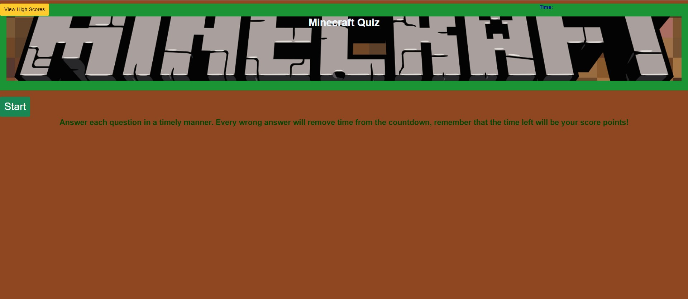

# JavasQuiz

  ## Table of Contents

  * [Acceptance Criteria](#acceptance-criteria)
  * [Links](#links)  
  * [Usage](#usage)
  * [Future Work](#future-work)
  * [Repo Data](#repo)

## Acceptance Criteria
GIVEN I am taking a code quiz
WHEN I click the start button
THEN a timer starts and I am presented with a question
WHEN I answer a question
THEN I am presented with another question
WHEN I answer a question incorrectly
THEN time is subtracted from the clock
WHEN all questions are answered or the timer reaches 0
THEN the game is over
WHEN the game is over
THEN I can save my initials and score

## Links

[Deployed Application](https://renbryant.github.io/JavasQuiz/)

## Usage
This quiz allows the user to click a start button to begin a quiz. Clicking the button will display the question, the answer choices, and begin the timer at the top. If the user clicks the wrong answer, 15 seconds are taken off of the timer. Finishing the quiz will send the user to a screen that allows them to input their initials.

## Future Work
Local Storage still needs to be done. Can't work with the view high scores, or clear high scores until then. Will continue to work on this even after it's done but wanted to give an update.

## Repo Data
This repo was contributed by RenBryant. I am a computer science student, a full-time worker, and a coding enthusiast! I love learning new things about computers and how they work and enjoy working on projects. Here is my GitHub Profile! [RenBryant](https://github.com/RenBryant). Thank you for checking out this project!